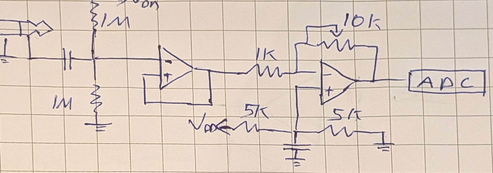

# EmbeddedPeach

This repository contains the code I use on my [ElectroSmith Daisy Seed](https://daisy.audio/products/daisy-seed). 

## The Project

The plan is to use the Daisy Seed as a DSP guitar pedal and audio interface. 

<!-- This project is my introduction to embedded programming. -->

## The Hardware

The circuitry is designed with both guitar and bass in mind. 

The audio codec input has a low input impedence of $13.6 \text{ k}\Omega$, which is too low to directly connect to a bass or guitar without signal loss. RRIO op-amps are used to achieve an input resistance of $1 \text{ M}\Omega$ on the Daisy Seed's $3.3 \text{ V}$ power supply. With this setup, no auxillary power is required.

Currently, an external amplifier is needed to amplify the output signal to low impedence headphones. Eventually, this is a capability I would like the circuit to provide itself.

